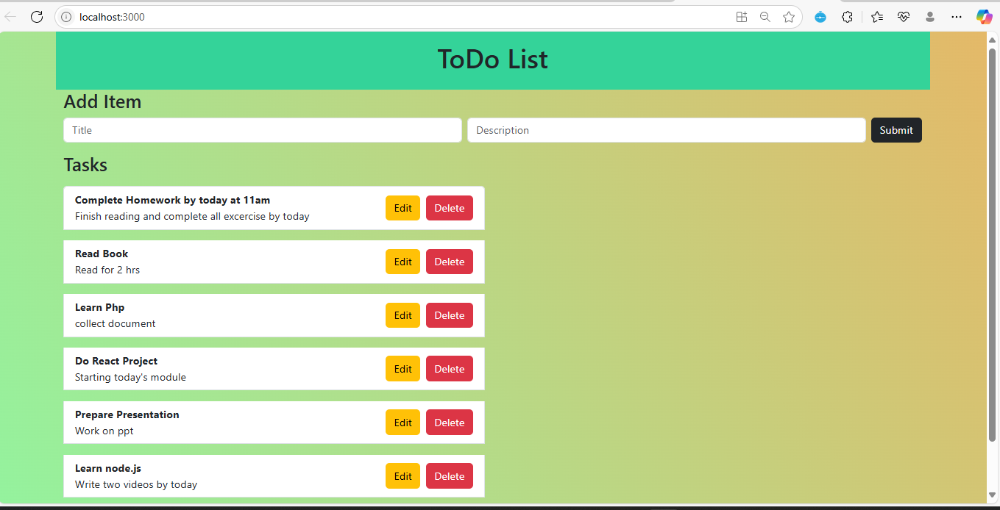
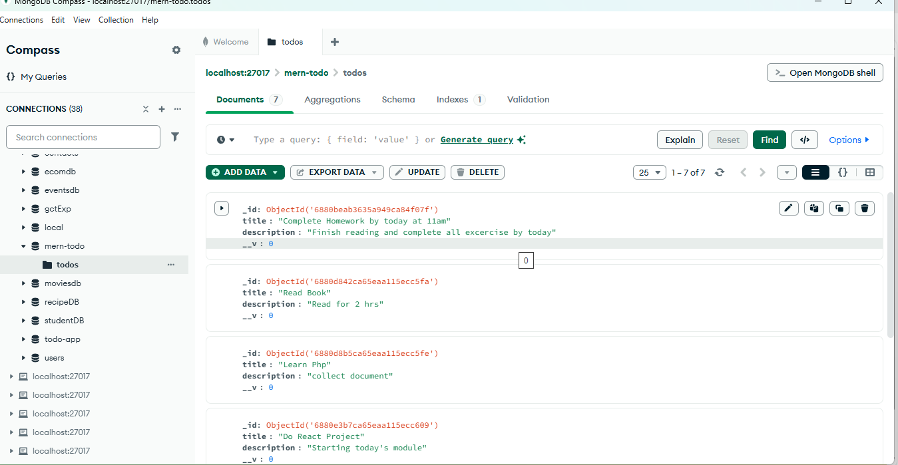

#  MERN Todo List Application

A full-stack Todo List app built using the MERN stack — **MongoDB**, **Express.js**, **React**, and **Node.js**. This project helped me understand the complete development cycle of a web application — from backend API creation to frontend rendering and interactivity.

---

##  Features

- Add, update, delete, and view todos (CRUD operations)
- Persistent storage using MongoDB
- RESTful API using Express and Node.js
- Interactive UI with React
- Hooks like `useState` and `useEffect`
- Fetch API for frontend-backend communication

---

##  What I Learned

###  React
- Built components using functional components
- Managed state using `useState`
- Performed side effects (like fetching data) with `useEffect`
- Controlled forms for creating and editing todos
- Used conditional rendering and list rendering with `.map()`

###  Node.js & Express
- Created a backend server using Node.js
- Defined RESTful routes using Express
- Handled HTTP methods: `GET`, `POST`, `PUT`, `DELETE`
- Managed middleware for JSON parsing and CORS

###  MongoDB (with Mongoose)
- Designed a schema for todos using Mongoose
- Connected Node.js backend to MongoDB
- Performed CRUD operations:
  - Create: `POST /todos`
  - Read: `GET /todos`
  - Update: `PUT /todos/:id`
  - Delete: `DELETE /todos/:id`

---

##  Tech Stack

| Layer      | Technology       |
|------------|------------------|
| Frontend   | React, CSS       |
| Backend    | Node.js, Express |
| Database   | MongoDB (Mongoose) |
| Communication | Fetch API     |

---
## 📸 Screenshot

